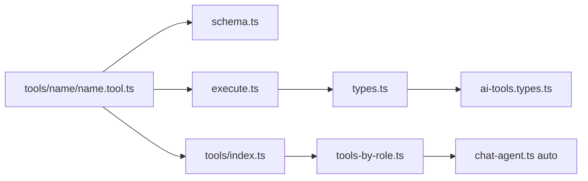

# Adding AI Tools

This guide explains how to add a new **native** (in-process) tool to AgentX. Each tool is a 4-file folder; wiring it in takes four touch points beyond the folder.

For external MCP servers, see [Adding MCP Tools](./adding-mcp-tools.md).

## Tool sources

| Source | Guide | Location |
|--------|-------|----------|
| Native | This document | `lib/ai/tools/` — in-process `tool()` factories |
| MCP | [adding-mcp-tools.md](./adding-mcp-tools.md) | `lib/ai/mcp/servers/` — external servers via runtime client |

Both sources share `lib/ai/roles/tools-by-role.ts` as the single role allowlist.

## Overview

```
lib/ai/tools/
├── tool-keys.ts           # NativeToolKey + McpToolKey union
├── ai-tools.types.ts      # ToolResult base + barrel re-exports
├── index.ts               # Native tool registry
├── resolve-tools.ts       # Merges native + MCP for chat agent
├── get-time/              # Example: public tool
│   ├── get-time.tool.ts
│   ├── schema.ts
│   ├── execute.ts
│   └── types.ts
├── echo/                  # Example: user-scoped tool
├── role-info/             # Example: role-aware tool
├── exa-web-search/        # Example: external REST API tool
└── exa-web-fetch/

lib/ai/roles/
├── hardcoded-user.ts      # Active dev user constant
└── tools-by-role.ts       # Which roles can use which tools
```

When a chat request arrives, `chat-agent.ts` calls `createAllToolsForUser()`, which merges native and MCP tools filtered by role, then passes them to `streamText`. You rarely need to touch the agent or API route when adding a native tool.



## Quick checklist

1. Create `lib/ai/tools/<tool-name>/` with all four files (see folder contract below)
2. Add the key to `NativeToolKey` in `lib/ai/tools/tool-keys.ts`
3. Register the tool in `lib/ai/tools/index.ts`
4. Add a barrel re-export in `lib/ai/tools/ai-tools.types.ts`
5. Allowlist the key in `lib/ai/roles/tools-by-role.ts` for each role that should see it
6. Test in chat at `/chat` with a prompt that should trigger the tool

## Folder contract

Every native tool folder contains four files:

```
lib/ai/tools/<tool-name>/
├── <tool-name>.tool.ts   # createXxxTool() — wires tool() only
├── schema.ts             # Zod inputSchema + exported input type
├── execute.ts            # executeXxx(input, ctx) — business logic
└── types.ts              # XxxToolResult extends ToolResult
```

### Thin factory (`<tool-name>.tool.ts`)

Export `createXxxTool`. Use `user` in the closure only when the tool needs identity or role.

**Public tool (no user)** — see [`get-time/`](../lib/ai/tools/get-time/):

```ts
export function createGetTimeTool() {
  return tool({
    description: "...",
    inputSchema: getTimeInputSchema,
    execute: executeGetTime,
  });
}
```

**User-scoped tool** — see [`echo/`](../lib/ai/tools/echo/):

```ts
export function createEchoTool(user: UserContext) {
  return tool({
    description: "...",
    inputSchema: echoInputSchema,
    execute: (input) => executeEcho(input, { user }),
  });
}
```

**Runtime-aware tool** — see [`create-schedule/`](../lib/ai/tools/create-schedule/):

```ts
export function createCreateScheduleTool(user, runtimeContext?) {
  return tool({
    description: "...",
    inputSchema: createScheduleInputSchema,
    execute: (input) => executeCreateSchedule(input, { user, runtimeContext }),
  });
}
```

### Schema (`schema.ts`)

```ts
export const myToolInputSchema = z.object({ /* fields */ });
export type MyToolInput = z.infer<typeof myToolInputSchema>;
```

### Execute (`execute.ts`)

| Tool category | Signature |
|---------------|-----------|
| Public (no user) | `executeXxx(input): Promise<XxxToolResult>` |
| User-scoped | `executeXxx(input, ctx: { user: UserContext })` |
| Runtime-aware | `executeXxx(input, ctx: { user; runtimeContext? })` |

Never import `HARDCODED_USER` inside execute — receive `user` via context.

### Types (`types.ts`)

```ts
import type { ToolResult } from "../ai-tools.types";

export interface MyToolResult extends ToolResult {
  data?: { /* fields */ };
}
```

Then add to `ai-tools.types.ts`:

```ts
export type { MyToolResult } from "./my-tool/types";
```

Keep `NativeToolKey` values in sync with the registry object keys in `index.ts`.

## Step 3: Register in index.ts

In `lib/ai/tools/index.ts`:

1. Import `createMyNewTool`
2. Add to `createToolRegistry`:

```ts
my_new_tool: createMyNewTool(user),
```

The registry key must match the `ToolKey` union entry.

## Step 4: Allowlist by role

In `lib/ai/roles/tools-by-role.ts`, add `"my_new_tool"` to the arrays for roles that should use it:

```ts
student: ["get_time", "echo", "role_info", "my_new_tool"],
```

Roles not listed will not expose the tool to the model, even if it is registered.

## Result shape convention

Return a consistent shape so the model can summarize outcomes:

```ts
{ success: true, data: { ... } }
{ success: false, message: "Why it failed" }
```

See `ToolResult` in `ai-tools.types.ts`.

## When to pass `user`

| Pattern | Pass `user`? | Example |
|---------|--------------|---------|
| Public utility (time, search) | No | `get_time` |
| Personalized / identity | Yes | `echo`, `role_info` |
| External API with user token | Yes (future) | — |

`resolveUser()` in the API route provides the user. Tools receive it via factory closure, not by reading constants or env.

## Switching dev user / role

Edit `lib/ai/roles/hardcoded-user.ts`:

```ts
export const HARDCODED_USER: UserContext = DEV_USERS.admin;
// or change DEV_USERS.student.role, etc.
```

Restart is not required beyond the dev server picking up the file change.

## Adding a new role

1. Add the role to `AppRole` in `lib/ai/roles/types.ts`
2. Add an entry in `DEV_USERS` in `hardcoded-user.ts`
3. Add a key in `TOOLS_BY_ROLE` in `tools-by-role.ts`

## Testing

Example prompts for stub tools:

| Tool | Example prompt |
|------|----------------|
| `get_time` | "What time is it in Asia/Jakarta?" |
| `echo` | "Echo back: hello world" |
| `role_info` | "What tools do I have access to?" |
| `exa_web_search` | "Cari berita AI terbaru" |
| `exa_web_fetch` | "Baca https://example.com dan ringkas" |

Watch the chat UI for tool badges (`Tool: get_time (running)` → `done`). Exa tools show Indonesian labels and source cards when search completes.

## External API tools (Exa example)

For tools that call an external HTTP API, extract the client into a shared module. Keep `execute.ts` thin — it calls the client, not raw `fetch`:

```
lib/ai/exa/
├── env.ts       # EXA_API_KEY parsing, isExaConfigured()
├── types.ts     # API response types
└── client.ts    # searchExa(), fetchExaContents()

lib/ai/tools/exa-web-search/
├── exa-web-search.tool.ts
├── schema.ts
├── execute.ts      # calls lib/ai/exa/client.ts
└── types.ts
```

Pattern:

1. `lib/ai/exa/client.ts` — `fetch` to `https://api.exa.ai/search` and `/contents` with `x-api-key` header
2. `execute.ts` calls the client, returns `{ success, data }` or `{ success: false, code, message }`
3. On missing `EXA_API_KEY`, return `code: "EXA_NOT_CONFIGURED"` so the model can relay a user-facing message
4. Add `EXA_API_KEY` to `.env.example`

Exa web search is a **native** tool, not MCP. See [Adding MCP Tools](./adding-mcp-tools.md) only for external MCP HTTP servers.

## Common mistakes

| Mistake | Symptom |
|---------|---------|
| Forgot registry entry in `index.ts` | Tool never called |
| Forgot role allowlist | Tool missing for some users |
| `ToolKey` / registry key mismatch | TypeScript error or silent omission |
| Importing `HARDCODED_USER` in tool | Breaks when auth is added later |
| Inconsistent result shape | Model gives vague or wrong summaries |
| Putting business logic in `.tool.ts` | Hard to test; file grows unbounded |
