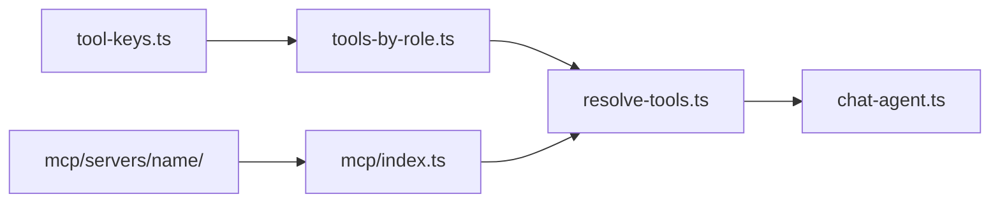

# Adding MCP Tools

This guide explains how to connect a new **external** MCP server to AgentX. Tools are discovered at runtime via `@ai-sdk/mcp` and filtered by role through the same allowlist as native tools.

See also: [Adding AI Tools](./adding-ai-tools.md) for in-process native tools.

> **Note:** Exa web search (`exa_web_search`, `exa_web_fetch`) is implemented as **native REST tools** in `lib/ai/exa/` and `lib/ai/tools/exa-web-*`, not via MCP. Use this guide for other external MCP HTTP servers only.

## Overview

```
lib/ai/mcp/
├── index.ts               # createMcpToolsForUser()
├── client.ts              # Per-request withMcpClient()
├── mcp-env.ts             # Env parsing + kill switch
└── servers/
    ├── index.ts           # MCP_TOOL_DEFINITIONS registry
    └── <server>/          # Per-server config, schemas, tools

lib/ai/tools/
├── tool-keys.ts           # NativeToolKey + McpToolKey union
└── resolve-tools.ts       # Merges native + MCP for chat agent

lib/ai/roles/
└── tools-by-role.ts       # Single allowlist for all tool sources
```

When a chat request arrives, `createAllToolsForUser()` loads native tools and MCP tools, then passes the merged set to the agent.



## Quick checklist

1. Create `lib/ai/mcp/servers/<server>/<server>.config.ts`, `schemas.ts`, `tools.ts`
2. Add `McpToolKey` entries to `lib/ai/tools/tool-keys.ts`
3. Register definitions in `lib/ai/mcp/servers/index.ts`
4. Add env parsing in `lib/ai/mcp/mcp-env.ts` if needed
5. Allowlist keys in `lib/ai/roles/tools-by-role.ts`
6. Add env vars to `.env.example`
7. Test at `/chat`

## Step 1: Server client config

In `lib/ai/mcp/servers/<server>/<server>.config.ts`, wire the external HTTP endpoint:

- Read URL and API keys from env
- Return `null` when not configured (server is skipped gracefully)

## Step 2: Tool schemas

In `lib/ai/mcp/servers/<server>/<server>.schemas.ts`, define Zod `inputSchema` per **external MCP tool name** (as exposed by the server).

These schemas are passed to `client.tools({ schemas })` at runtime. Only tools listed here can be loaded, and only those whose `ToolKey` is in the user's role allowlist are requested.

## Step 3: Tool definitions

In `lib/ai/mcp/servers/<server>/<server>.tools.ts`, map external names to unified `ToolKey` values:

```ts
export const MY_SERVER_TOOL_DEFINITIONS: McpToolDefinition[] = [
  {
    serverKey: "my_server",
    mcpToolName: "external_tool_name",
    toolKey: "my_server_external_tool",
  },
];
```

The `toolKey` is what appears in the agent and the chat UI. Use a server prefix to avoid collisions.

## Step 4: Add McpToolKey types

In `lib/ai/tools/tool-keys.ts`, add entries to `MCP_TOOL_KEYS` and derive `McpToolKey` from that array.

## Step 5: Register server

In `lib/ai/mcp/servers/index.ts`:

1. Import the new server's `*_TOOL_DEFINITIONS`
2. Append to `MCP_TOOL_DEFINITIONS`
3. Add an entry to `MCP_SERVERS`

If the server needs custom schema building logic, extend `buildSchemasForServer()` in `lib/ai/mcp/index.ts`.

## Step 6: Allowlist by role

In `lib/ai/roles/tools-by-role.ts`, add MCP keys for roles that should use them.

`guest` typically gets native tools only. MCP tools not in the role array are never loaded.

## Step 7: Environment variables

Add to `.env.example` and `lib/ai/mcp/mcp-env.ts`:

| Variable | Purpose |
|----------|---------|
| `MCP_ENABLED` | Global kill switch (`false` disables all MCP) |

## Runtime lifecycle

Each chat request that needs MCP tools:

1. `createMcpToolsForUser()` groups allowed keys by server
2. `withMcpClient()` opens an HTTP connection via `createMCPClient`
3. `client.tools({ schemas })` loads only allowlisted tools
4. Tool names are renamed from MCP names to unified `ToolKey` values
5. `client.close()` runs in `finally` (per-request, serverless-safe)

If a server is unreachable, the chat continues with native tools only.

## Common mistakes

| Mistake | Symptom |
|---------|---------|
| `mcpToolName` mismatch with external server | Tool not found at runtime |
| Forgot `tool-keys.ts` update | TypeScript error or filter skips tool |
| Forgot role allowlist | Tool missing for some users |
| `toolKey` / rename map mismatch | Wrong or missing tool in agent |
| `MCP_ENABLED=false` | All MCP tools silently skipped |

## Tool sources

| Source | Location | When to use |
|--------|----------|-------------|
| Native | `lib/ai/tools/` | In-process logic, REST APIs (e.g. Exa) |
| MCP | `lib/ai/mcp/servers/` | External services with MCP HTTP endpoints |

Both sources share `tools-by-role.ts` as the single permission allowlist.
